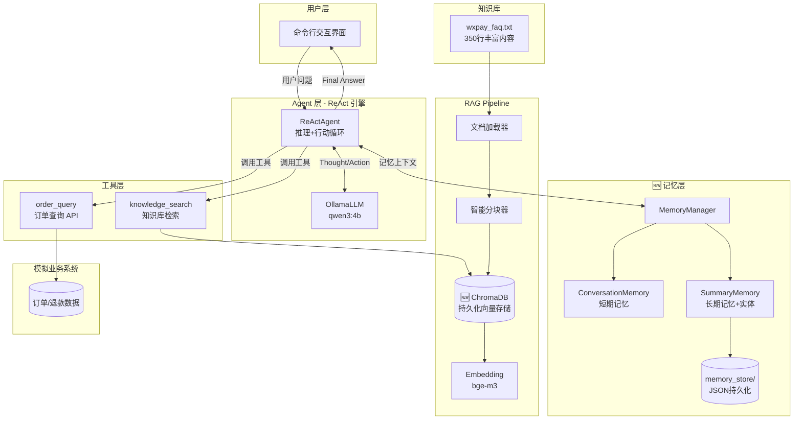
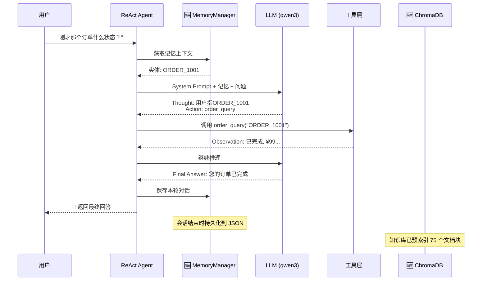

# WePayAgent 智能客服系统

> 🤖 基于 RAG + ReAct 架构的微信支付智能客服 Demo 系统

## 📋 项目概述

本项目是一个**端到端可运行**的智能客服演示系统，模拟微信支付客服场景。项目采用模块化设计，通过 RAG（检索增强生成）和 ReAct（推理 + 行动）两大技术架构，实现对支付政策、业务规则、订单状态等问题的智能问答能力。

### 核心亮点

| 特性 | 说明 |
|------|------|
| 🔄 **双模块设计** | RAG Pipeline + ReAct Agent 分离，职责清晰 |
| 🌊 **流式输出** | 实时逐字输出，用户体验更佳 |
| 🧠 **记忆系统** | 短期+长期记忆，支持跨轮引用和实体追踪 |
| 🗄️ **ChromaDB** | 持久化向量存储，支持大规模知识库 |
| 🔧 **工具扩展** | 标准化工具接口，支持知识检索、订单查询等 |
| 📊 **自动评测** | 内置 LLM-as-a-Judge 评测框架 |
| 🏠 **完全本地** | 基于 Ollama，无需云 API，隐私安全 |

---

## 🏗️ 系统架构



---

## 📂 项目结构

```
wePayAgent_Demo/
├── agent_demo/                    # ReAct Agent 模块
│   ├── main.py                    # 主入口 + 环境检查
│   ├── agent_core.py              # ReAct 引擎核心
│   ├── tools.py                   # 工具定义（RAG + 订单API）
│   ├── memory.py                  # 🆕 对话记忆系统
│   ├── vector_store.py            # 🆕 ChromaDB 向量存储封装
│   ├── requirements.txt           # Python 依赖
│   ├── memory_store/              # 🆕 长期记忆持久化目录
│   │   └── long_term_memory.json
│   └── chroma_db/                 # 🆕 ChromaDB 索引存储
│
├── rag_demo/                      # RAG Pipeline 模块
│   ├── rag_demo.py                # 完整 RAG 实现
│   ├── evaluate_rag.py            # 自动评测脚本
│   ├── test_ollama.py             # Ollama 连通性测试
│   ├── requirements.txt           # Python 依赖
│   ├── knowledge_base/            # 知识库文档（已丰富到350行）
│   │   └── wxpay_faq.txt
│   └── data/
│       └── benchmark_qa.json      # 评测测试集
│
└── docs/                          # 开发文档
    └── 2025-12-20_memory_chromadb.md
```

---

## 🔧 技术栈选型

### 核心组件

| 层次 | 组件 | 技术选型 | 选型理由 |
|------|------|----------|----------|
| **LLM 推理** | 大语言模型 | Ollama + qwen3:4b | 本地部署、隐私安全、中文能力强 |
| **向量化** | Embedding | bge-m3 (via Ollama) | 多语言支持、开源免费 |
| **文本分块** | Text Splitter | LangChain RecursiveCharacterTextSplitter | 智能分块、中文优化 |
| **向量存储** | Vector DB | 自研 SimpleVectorStore | 轻量级、混合检索（向量+关键词） |
| **Agent 框架** | 推理引擎 | ReAct Pattern 手写实现 | 可控性强、便于定制 |

### 技术栈详情

```yaml
运行环境:
  - Python: 3.10+
  - Ollama: 本地 LLM 推理服务

核心依赖:
  - langchain: >=0.1.0         # 文档分块
  - langchain-community: >=0.0.10
  - chromadb: >=0.4.0          # (可选) 向量存储
  - openai: >=1.0.0            # (可选) OpenAI 后端
  - numpy: >=1.24.0            # 向量计算
  - requests                   # HTTP 客户端

推荐模型:
  - LLM: qwen3:4b / qwen2.5:7b
  - Embedding: bge-m3
```

---

## 🧠 核心模块说明

### 1. ReAct Agent (`agent_demo/`)

采用 **ReAct (Reasoning + Acting)** 模式，Agent 在回答问题时遵循以下循环：

```
Thought → Action → Observation → ... → Final Answer
```

**核心特性：**
- **流式输出**：基于 Ollama 流式 API，逐 Token 输出，配合 Spinner 动画
- **Self-Correction**：工具执行出错时，自动引导 LLM 分析原因并调整策略
- **身份固定**：通过 System Prompt 约束角色，拒绝越界请求

```python
# 工具调用示例
class KnowledgeBaseTool:
    name = "knowledge_search"
    description = "查询微信支付官方政策、费用标准、操作指南等知识"
    
    def run(self, query: str) -> str:
        # 执行 RAG 检索并返回结果
        ...
```

### 2. RAG Pipeline (`rag_demo/`)

完整的检索增强生成流程：

| 阶段 | 处理步骤 |
|------|----------|
| **离线索引** | 文档加载 → 智能分块 → Embedding → 向量存储 |
| **在线查询** | 问题 Embedding → 混合检索 → Prompt 构建 → LLM 生成 |

**混合检索策略：**
```python
# 综合打分 = 向量相似度 * 0.7 + 关键词匹配 * 0.3
if use_vector:
    final_score = vector_score * 0.7 + jaccard_score * 0.3
```

### 3. 自动评测 (`evaluate_rag.py`)

采用 **LLM-as-a-Judge** 模式进行质量评估：

- **语义打分**：LLM 对比标准答案，给出 0-10 分
- **关键词覆盖**：检测回答是否包含关键信息点

---

## 🚀 快速启动

### 环境准备

```bash
# 1. 安装 Ollama
# Windows: winget install Ollama.Ollama
# 或访问 https://ollama.ai 下载

# 2. 拉取模型
ollama pull qwen3:4b
ollama pull bge-m3

# 3. 安装 Python 依赖
cd rag_demo
pip install -r requirements.txt
```

### 运行 Agent Demo

```bash
cd agent_demo
python main.py

# 示例对话:
# 👤我: 微信支付结算周期是多久？
# 🤖 智能客服: 微信支付的标准结算周期为T+1...
```

### 运行 RAG Demo

```bash
cd rag_demo
python rag_demo.py --ollama

# 或使用模拟模式（无需 Ollama）
python rag_demo.py --mock
```

### 运行评测

```bash
cd rag_demo
python evaluate_rag.py
```

---

## 🔄 数据流图



---

## 📊 评测指标

基于内置测试集的评测结果参考：

| 指标 | 说明 | 目标值 |
|------|------|--------|
| **Semantic Score** | LLM 语义评分 (0-10) | ≥ 7.0 |
| **Keyword Coverage** | 关键词覆盖率 | ≥ 80% |

---

## 🎯 设计决策

### 为什么选择 ReAct 而非 Router/Chain？

| 方案 | 优势 | 劣势 |
|------|------|------|
| **ReAct** ✅ | 可解释性强、支持多轮工具调用 | 推理开销稍大 |
| Router | 快速分发 | 不支持动态多步 |
| LCEL Chain | 声明式、易组合 | 灵活性不足 |

### 为什么选择 Ollama + 本地模型？

1. **隐私合规**：支付场景数据敏感，本地部署更安全
2. **成本可控**：无 API 调用费用
3. **低延迟**：本地推理，响应更快
4. **离线可用**：不依赖网络

---

## 📝 后续扩展方向

- [ ] 接入真实业务 API（订单系统、退款系统）
- [x] ~~增强向量存储（引入 Chroma/Milvus）~~ ✅ 已完成 (2025-12-20)
- [x] ~~添加对话历史记忆（Memory）~~ ✅ 已完成 (2025-12-20)
- [x] ~~多轮对话上下文管理~~ ✅ 已完成 (2025-12-20)
- [ ] Web UI / 小程序前端
- [ ] 性能监控与日志追踪
- [ ] 更多实体类型提取（商户号、交易时间等）
- [ ] 基于 LLM 的智能摘要

---

## 📄 License

MIT License - 本项目仅供学习和技术演示使用。
